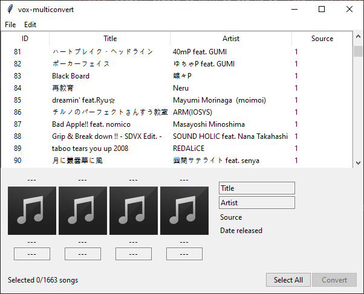

# vox-multiconvert
A `.vox` to `.ksh` converter, with some additional features. Built off [my fork of TsFreddie's `vox2ksh` project](https://github.com/muskit/VOX2KSH).
Tested with December 2020 archives.



## Prerequisites
`ffmpeg` install either on PATH or set up in `Edit > Preferences`.

### Required PIP Modules
* `tk`
* `Pillow`
* `ffmpeg-python`

## Usage
`python3 vox-multiconvert.py`

or

```
chmod +x vox-multiconvert.py
./vox-multiconvert.py # (shebang'd)
```

## TODO
* special case where each level of a song has its own audio file
* sorting
* searching/filtering